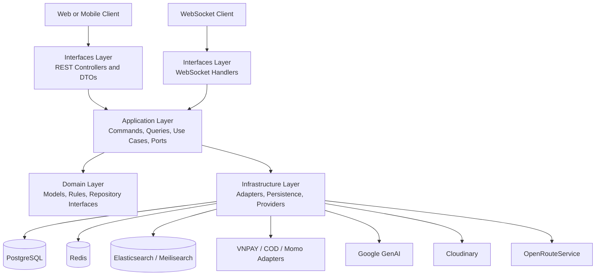
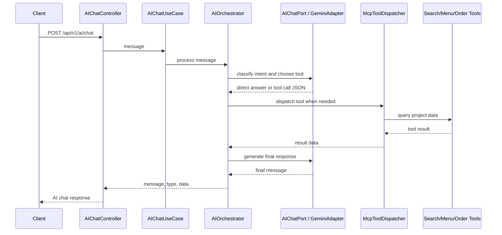
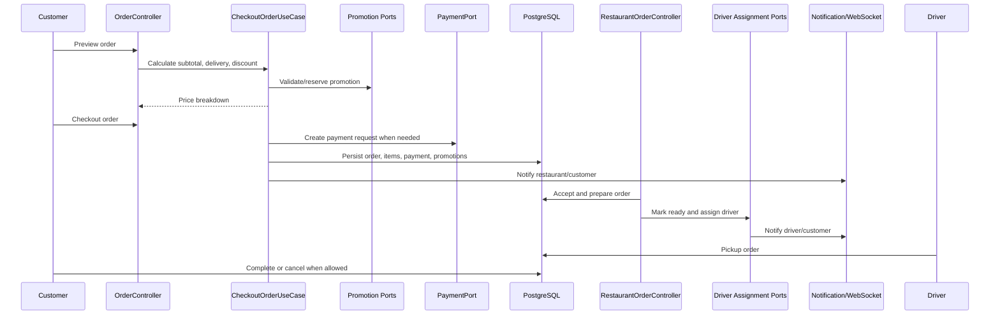

# FoodieDash

FoodieDash is a backend system for a food ordering platform. It models the core
workflows behind a delivery product: customer registration, restaurant and menu
management, cart checkout, promotions, payment handling, order lifecycle updates,
driver assignment, notifications, and search.

The project is built as a production-oriented Spring Boot backend rather than a
single CRUD demo. The codebase emphasizes Clean Architecture, explicit use cases,
database migrations, search infrastructure, Redis-backed coordination, JWT/OAuth2
security, payment provider integration, Dockerized local services, and CI checks.

## Table of Contents

- [Project Overview](#project-overview)
- [Features](#features)
- [Tech Stack](#tech-stack)
- [Architecture](#architecture)
- [Database Design](#database-design)
- [API Design](#api-design)
- [AI/Search Features](#aisearch-features)
- [Order Flow](#order-flow)
- [Authentication & Authorization](#authentication--authorization)
- [Payment Integration](#payment-integration)
- [Docker & CI/CD](#docker--cicd)
- [Challenges & Trade-offs](#challenges--trade-offs)
- [What I Learned](#what-i-learned)
- [Future Improvements](#future-improvements)
- [Local Development](#local-development)

## Project Overview

FoodieDash is designed around real backend responsibilities found in marketplace
and delivery systems:

- Customers browse restaurants and menu items, manage carts, preview order totals,
  apply promotions, and place orders.
- Restaurants manage menus, operating state, preparation settings, and order
  status transitions.
- Drivers receive assignment-related workflows and can pick up orders.
- The platform coordinates search, payment, notifications, security, persistence,
  and operational health around those workflows.

The project demonstrates backend engineering skills that are relevant in technical
screening:

| Area | What the project demonstrates |
|------|-------------------------------|
| Architecture | Clean Architecture with domain, application, infrastructure, and interface layers |
| Data modeling | Multi-domain PostgreSQL schema managed through Flyway migrations |
| Workflow design | Order checkout, preview, acceptance, preparation, pickup, completion, and cancellation |
| Integrations | Redis, Elasticsearch, Meilisearch, Google OAuth2, Google GenAI, VNPAY, Cloudinary, WebSocket |
| Operations | Docker Compose, health endpoints, Prometheus metrics, CI build/test workflow |

## Features

- **User and profile management**: customer and merchant registration, customer
  profiles, addresses, password changes, and role/permission modeling.
- **Restaurant management**: restaurant profiles, categories, category mappings,
  business hours, images, pauses, ratings, and preparation settings.
- **Menu management**: menus, menu items, item options, option values, soft delete,
  restore, submit, and restaurant menu views.
- **Cart workflow**: cart creation, item addition, quantity changes, option values,
  soft delete/restore, and cart count retrieval.
- **Order workflow**: order preview, checkout, detail view, cancellation,
  completion, restaurant acceptance/preparation/ready states, driver pickup, and
  automatic driver assignment support.
- **Promotion workflow**: promotion creation, status changes, restaurant mapping,
  eligibility checks, discount calculation, reservation, confirmation, and release.
- **Payment workflow**: payment method management, COD adapter, VNPAY return
  handling, signature verification port, and provider-specific adapter structure.
- **Search workflow**: restaurant search and reindexing, menu item semantic search,
  Elasticsearch vector search, and Meilisearch rollback compatibility.
- **AI workflow**: `POST /api/v1/ai/chat` accepts a user message, routes it
  through an AI orchestration use case, and can call internal tools such as
  restaurant search, menu item search, order tracking, or order creation.
- **Notifications**: customer, merchant, and driver notification APIs with
  WebSocket publishing infrastructure.
- **Operational endpoints**: health, metrics, and Prometheus exposure through
  Actuator.

## Tech Stack

| Technology | Role in FoodieDash | Engineering skill demonstrated |
|------------|--------------------|--------------------------------|
| Java 21 | Backend language and runtime | Modern Java service development |
| Spring Boot 4 | Application framework | REST APIs, dependency injection, configuration |
| Spring Security | Authentication and authorization | JWT filters, method-level permissions, stateless sessions |
| OAuth2 / Google Login | Social login support | External identity provider integration |
| JJWT | JWT creation and validation | Token-based authentication |
| PostgreSQL | Primary relational database | Transactional data modeling for marketplace workflows |
| Flyway | Database migrations | Versioned schema evolution |
| Spring Data JPA | Persistence abstraction | Repository-backed data access |
| Redis | Cache and coordination store | Driver dispatch state, locks, and short-lived workflow data |
| Elasticsearch | Search and vector search | Indexing, kNN search, semantic menu item matching |
| Meilisearch | Search rollback path | Search-engine abstraction and migration-friendly design |
| Spring AI / Google GenAI | Chat and embedding integration | AI ports, adapters, and semantic search inputs |
| MapStruct | DTO/domain/entity mapping | Explicit mapping boundaries between layers |
| WebSocket/STOMP | Realtime updates | User-scoped notification delivery |
| Cloudinary | Media storage integration | External asset provider abstraction |
| VNPAY | Payment gateway integration | Payment return flow and signature verification |
| Docker / Docker Compose | Local runtime environment | Reproducible service dependencies |
| GitHub Actions | CI validation | Maven verification and Docker image build checks |
| Actuator / Prometheus | Observability | Health, metrics, and scrape-ready endpoints |

## Architecture

FoodieDash follows Clean Architecture / Hexagonal Architecture. Business rules are
kept in the domain and application layers, while frameworks and providers stay in
infrastructure. Controllers and WebSocket handlers translate transport requests
into application use cases instead of owning business logic.



Layer responsibilities:

| Layer | Responsibility | Examples |
|-------|----------------|----------|
| `domain` | Business entities, rules, enums, repository interfaces | `Order`, `OrderStatus`, `Restaurant`, `Promotion` |
| `application` | Use cases, commands, query results, ports | `CheckoutOrderUseCase`, `PreviewOrderUseCase`, `PaymentPort` |
| `infrastructure` | External technology implementations | JPA adapters, Redis adapters, search adapters, payment adapters |
| `interfaces` | REST/WebSocket entry points and DTO mapping | order, cart, restaurant, search, auth, notification controllers |

This structure keeps the codebase microservice-ready: each domain area already has
clear boundaries, application contracts, and infrastructure adapters that could be
split later when operational needs justify the cost.

## Database Design

The database is PostgreSQL, managed by Flyway migrations under
`src/main/resources/db/migration/`. Migrations are grouped by business area, which
makes the schema easier to review during feature work.

| Domain area | Tables / migration focus |
|-------------|--------------------------|
| Restaurant | restaurants, business hours, categories, category maps, images, pauses, ratings, preparation settings |
| Menu | menus, menu items, item options, option values, restaurant linkage, sequence fixes |
| Cart | carts, cart items, cart item options, cart item option values |
| Order | orders, order items, deliveries, payments, promotions, status histories |
| Promotion | promotions, usages, usage counters, restaurant mappings, eligibility rules |
| User | users, roles, permissions, user roles, merchant restaurants, devices, customer/merchant/driver profiles |
| Notification | notification records for customer, merchant, and driver workflows |

Design choices:

- **Order snapshots**: order item names, images, options, and prices are modeled
  separately from current menu data so completed orders are not rewritten when a
  restaurant changes its menu.
- **Promotion reservation flow**: promotion validation, reservation, confirmation,
  and release are separate API operations to reduce double-spend risk during
  checkout.
- **Status histories**: order status changes are represented separately from the
  current order state, which supports audit and workflow debugging.
- **Flyway validation**: migrations are enabled and validated at startup, keeping
  schema changes explicit.

## API Design

REST endpoints use the `/api/v1` prefix and resource-oriented controllers. The
API surface is organized around business workflows instead of exposing database
tables directly.

| Area | Representative routes | Purpose |
|------|-----------------------|---------|
| Auth | `POST /api/v1/auth/login`, `POST /api/v1/auth/google` | Email/password and Google login |
| Users | `POST /api/v1/users/register/customer`, `POST /api/v1/users/register/merchant` | Account registration |
| Customer profile | `GET /api/v1/customers/me`, `POST /api/v1/customers/addresses` | Profile and address management |
| Restaurants | `POST /api/v1/restaurants`, `GET /api/v1/restaurants/slug/{slug}` | Restaurant lifecycle and discovery |
| Menus | `POST /api/v1/menus`, `PUT /api/v1/menus/{id}/submit` | Menu lifecycle |
| Carts | `POST /api/v1/carts`, `GET /api/v1/carts/count` | Cart and item management |
| Orders | `POST /api/v1/orders/preview`, `POST /api/v1/orders/checkout` | Price preview and checkout |
| Restaurant orders | `POST /api/v1/restaurant/orders/{orderId}/accept` | Merchant order state changes |
| Driver orders | `POST /api/v1/driver/orders/{orderId}/pickup` | Driver pickup workflow |
| Promotions | `POST /api/v1/promotions/validate`, `POST /api/v1/promotions/reserve` | Discount eligibility and reservation |
| Payments | `GET /api/v1/payment/vnpay/return` | Payment gateway callback handling |
| Notifications | `GET /api/v1/customers/me/notifications` | User-scoped notifications |
| AI assistant | `POST /api/v1/ai/chat` | Natural-language assistant backed by tool orchestration |
| Search | `GET /api/v1/restaurants/search`, `POST /api/v1/menu-items/semantic-search` | Restaurant and menu item search |

Controllers use request/response DTOs and mappers. Application use cases receive
commands or parameters and return query results, keeping transport concerns out of
domain logic.

## AI/Search Features

FoodieDash exposes its AI assistant through `AIChatController`:

```http
POST /api/v1/ai/chat
```

The request contains a user message. `AIChatUseCase` delegates the message to
`AIOrchestrator`, which decides whether to answer directly or call an internal
tool. Tool results are converted into a final user-facing response with a response
type and optional data payload.

The AI assistant can route requests to these tool categories:

| Tool | Purpose |
|------|---------|
| `search_restaurant` | Search restaurants by keyword, category, location, rating, open state, and pagination |
| `search_menu_item` | Search foods, dishes, or drinks by item name and optional price range |
| `track_order` | Return order tracking information from an order code |
| `create_order` | Create an order from restaurant, item, payment, and delivery details |

FoodieDash also contains dedicated search endpoints and infrastructure that the
AI tools can build on:

- **Restaurant search**: category, text, location, open-state, rating, radius,
  pagination, indexing, and full reindexing.
- **Menu item semantic search**: message-based menu item search backed by
  embeddings and Elasticsearch vector matching.

The search engine can be switched with `search.engine`:

| Engine | Role |
|--------|------|
| Elasticsearch | Default path for restaurant indexing and menu item vector search |
| Meilisearch | Rollback-friendly restaurant search path |

AI chat tool orchestration flow:



The important design point is that the REST API stays thin: `AIChatController`
only maps the request and response, while orchestration, model calls, and tool
dispatch remain in the application and infrastructure layers.

## Order Flow

Order handling is modeled as a workflow rather than a single insert operation.
The domain exposes statuses such as `PENDING`, `ACCEPTED`, `PREPARING`, `READY`,
`AWAITING_PICKUP`, `DELIVERING`, `COMPLETED`, and `CANCELLED`.



Key workflow decisions:

- Preview and checkout are separate so the client can show pricing before final
  submission.
- Promotions have reservation and confirmation steps to protect discount usage.
- Driver assignment is modeled through application ports and Redis-backed
  coordination, keeping dispatch infrastructure replaceable.
- Notifications are emitted through application/infrastructure boundaries so REST
  workflows can trigger realtime updates.

## Authentication & Authorization

FoodieDash supports token-based authentication and Google login:

- `AuthController` handles email/password login and Google login.
- `JwtAuthenticationFilter` reads tokens and prepares the security context.
- `JwtTokenGenerator` handles token creation.
- `GoogleIdentityVerifierAdapter` isolates Google identity verification.
- Roles and permissions are represented in Flyway migrations and enforced with
  method-level annotations such as `@PreAuthorize`.

Security is stateless at the HTTP layer. Public routes include auth, registration,
VNPAY return handling, WebSocket handshake, health/info, and error endpoints.
Protected workflow methods use permission names such as `ORDER_CREATE`,
`ORDER_VIEW_OWN`, and `ORDER_CANCEL`.

## Payment Integration

Payment concerns are separated behind application ports and provider adapters:

| Component | Responsibility |
|-----------|----------------|
| `PaymentPort` | Common application contract for payment providers |
| `PaymentPortFactory` | Chooses the payment adapter for a payment method |
| `VnpayAdapter` | Builds VNPAY payment requests |
| `VnpaySignatureVerifierAdapter` | Verifies VNPAY return signatures |
| `HandleVnpayReturnUseCase` | Processes payment gateway return data |
| `CodeAdapter` | Cash-on-delivery style payment path |
| `MomoAdapter` | Placeholder/provider adapter path for Momo-style payments |

The trade-off is deliberate: a provider abstraction adds more classes, but it
keeps checkout logic independent from gateway-specific request signing and return
validation.

## Docker & CI/CD

Docker Compose provides the local service environment:

| Service | Purpose |
|---------|---------|
| `backend` | FoodieDash Spring Boot application |
| `postgres` | PostgreSQL 16 database |
| `elasticsearch` | Elasticsearch 8.13.4 search engine |
| `kibana` | Elasticsearch inspection UI |
| `redis` | Cache and workflow coordination store |

The Dockerfile uses a multi-stage build:

1. Maven and JDK image downloads dependencies and builds the application jar.
2. Lightweight JRE image runs the packaged application.

GitHub Actions validates the project with:

- PostgreSQL service container for Flyway-backed verification.
- JDK 21 setup with Maven cache.
- `mvn -B -ntp clean verify`.
- Docker image build validation.

Operational endpoints:

- `GET /actuator/health`
- `GET /actuator/metrics`
- `GET /actuator/prometheus`

## Challenges & Trade-offs

| Decision | Benefit | Trade-off |
|----------|---------|-----------|
| Clean Architecture | Keeps business rules separate from Spring, JPA, and providers | More packages and mapping code than a small CRUD app |
| Use-case-per-action style | Makes workflows such as checkout, preview, accept, prepare, and pickup easy to locate | Requires discipline to avoid duplicate orchestration |
| PostgreSQL + Flyway | Gives explicit schema history for a multi-domain system | Migration order and validation require care |
| Search abstraction with Elasticsearch and Meilisearch | Allows semantic/vector search while keeping a rollback path | Two search engines increase configuration and indexing complexity |
| Redis-backed coordination | Supports dispatch state, locks, and short-lived workflow data | Requires operational awareness of TTLs and consistency boundaries |
| Payment provider adapters | Keeps checkout independent from gateway details | Signature verification and callback handling add edge cases |
| WebSocket notifications | Enables realtime user updates | Requires token-aware handshake and user routing concerns |

## What I Learned

- How to model a food ordering backend around workflows rather than isolated CRUD
  endpoints.
- How Clean Architecture affects package boundaries, dependency direction, and
  testability.
- How order totals depend on snapshots, option values, delivery fees, and
  promotion state.
- How search infrastructure changes the data lifecycle because entities must be
  indexed, reindexed, and sometimes rolled back to another engine.
- How payment integration requires a careful return flow, signature validation,
  and provider isolation.
- How Redis can support coordination use cases such as driver dispatch and
  promotion locks without becoming the source of truth.
- How production-oriented documentation should explain trade-offs, not just list
  technologies.

## Future Improvements

- Add more automated tests around order pricing, promotion reservation, payment
  return handling, and search fallback behavior.
- Add OpenAPI examples or a generated API reference for the main `/api/v1`
  workflows.
- Expand recommendation behavior from semantic menu search toward personalized
  restaurant/menu ranking based on order history and location.
- Split high-change modules such as search, notification, or payment into
  deployable services if traffic and team ownership justify microservices.
- Add observability dashboards for checkout, search latency, payment callbacks,
  driver assignment, and notification delivery.
- Add a production deployment profile with secret management, TLS, and managed
  database/search/cache services.

## Local Development

### Prerequisites

- Java 21
- Maven 3.9+
- Docker and Docker Compose
- Environment variables in `.env` or your shell for database, JWT, OAuth2,
  Cloudinary, search, route, and payment settings

### Start Dependencies

```bash
docker compose -f docker-compose.service.yaml up -d postgres elasticsearch redis
```

Optional search inspection:

```bash
docker compose -f docker-compose.service.yaml up -d kibana
```

This compose file is intended for local development services only. It starts
PostgreSQL, Elasticsearch, Kibana, and Redis while the Spring Boot application is
run from Maven on the host machine.

### Run The Application

```bash
mvn -DskipTests spring-boot:run
```

The application uses `server.port=${SERVER_PORT:9090}` in
`src/main/resources/application.properties`.

### Search Engine Switch

Elasticsearch is the default:

```properties
search.engine=elasticsearch
elasticsearch.host=http://localhost:9200
```

Meilisearch remains available as a rollback-friendly path:

```properties
search.engine=meilisearch
meilisearch.host=http://localhost:7700
```

### Reindex Search Data

After the application is running and the search service is healthy:

```http
POST /api/v1/restaurants/search/reindex
```

### Health And Metrics

```http
GET /actuator/health
GET /actuator/metrics
GET /actuator/prometheus
```

### CI Equivalent Check

```bash
mvn -B -ntp clean verify
```
